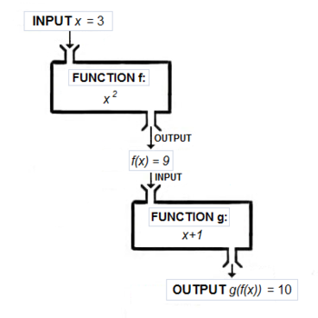

# Haskell 基础
CIS 194 Week 1
14 January 2013

建议阅读:

- Learn You a Haskell for Great Good, chapter 2
- Real World Haskell, chapters 1 and 2

## 什么是 Haskell?

Haskell是一种 lazy 的函数式编程语言，由一个学术委员会在1980年代末创建。 当时有大量 lazy 的函数式语言，每个人都有自己的最爱，而且很难沟通想法。因此，一群人聚集在一起设计了一种新的语言，从现有的语言中吸取了一些最好的想法（还有一些他们自己的新想法）。Haskell 就这样诞生了。

那么，什么是Haskell？Haskell是：

**函数式**

对于 "函数式" 一词，并没有确切的、公认的含义。但当我们说 Haskell 是一种函数式语言时，我们通常会想到两件事：

- 函数是 first-class 的，也就是说，函数是可以和其他种类的值完全相同的方式使用的值。

- Haskell程序的含义是以执行表达式为中心，而不是执行指令。

这些因素加在一起，导致了一种完全不同的编程思维方式。本学期我们的大部分时间将用于探索这种思维方式。

**纯的**

Haskell表达式总是指代透明的，也就是说：

- 没有可变性!一切（变量、数据结构......）都是不可变的。

- 表达式永远不会有 "副作用"（如更新全局变量或打印到屏幕）。

- 用相同的参数调用相同的函数，每次都会有相同的输出。

在这一点上，这可能听起来很疯狂。在没有可变性或副作用的情况下，怎么可能完成任何事情呢？好吧，这当然需要转变思维（如果你习惯于命令式或面向对象的范式）。但是一旦你做了这个转变，就会有很多奇妙的好处：

- 等式推理和重构：在Haskell中，人们总是可以 "用等式替换等式"，就像你在代数课上学到的那样。

- 平行性：当表达式被保证不互相影响时，并行评估表达式是很容易的。

- 更少的头疼：简单地说，不受限制的效果和远距离行动使得程序难以调试、维护和推理。

**惰性**

在Haskell中，表达式在真正需要其结果时才会被执行。这是一个简单的决定，但却有着深远的影响，我们将在整个学期中探讨这些问题。其中的一些后果包括：

- 仅仅通过定义一个函数，就可以很容易地定义一个新的控制结构。

- 仅仅通过定义一个函数，就可以很容易地定义一个新的控制结构。

- 它可以实现更多的组合式编程风格（见下面的 wholemeal 编程）。

- 然而，一个主要的缺点是，关于时间和空间使用的推理变得更加复杂了!

静态类型

每个Haskell表达式都有一个类型，而且类型都是在编译时检查的。有类型错误的程序甚至不会被编译，更不会运行。

## 主题

在整个课程中，我们将重点关注三个主要主题。

### 类型

静态类型系统可能看起来很烦人。事实上，在C++和Java这样的语言中，它们是令人讨厌的。但这并不是因为静态类型系统本身很烦人，而是因为C++和Java的类型系统表现力不够强本学期我们将仔细研究Haskell的类型系统，该系统
- 有助于理清思路和表达方案结构

写一个Haskell程序的第一步通常是写下所有的类型。因为Haskell的类型系统具有很强的表现力，这是一个非同寻常的设计步骤，对理清自己的程序思路有极大的帮助。

- 作为文件的一种形式

考虑到一个富有表现力的类型系统，仅仅看一个函数的类型就可以知道这个函数可能做什么以及如何使用它，甚至在你阅读一个字的书面文档之前。

- 将运行时的错误变成编译时的错误

能够预先解决错误，要比只是大量测试并希望得到最好的结果要好得多。"如果它能编译，它就一定是正确的 "这句话大部分是开玩笑的（即使在类型正确的程序中，仍然很有可能出现逻辑错误），但它在Haskell中发生的次数比其他语言多得多。

### 抽象

"Don’t Repeat Yourself" 是一个在编程世界中经常听到的咒语。它也被称为 "抽象原则"，意思是没有任何东西应该被重复：每个想法、算法和数据都应该在你的代码中出现一次。把类似的代码片断，剔除它们的共同点，被称为抽象的过程。

Haskell非常善于抽象：像参数化多态性、高阶函数和类型类这样的功能都有助于打击重复。本学期我们的哈斯克尔之旅在很大程度上将是一次从具体到抽象的旅程。

Wholemeal programming

Another theme we will explore is wholemeal programming. A quote from Ralf Hinze:

“Functional languages excel at wholemeal programming, a term coined by Geraint Jones. Wholemeal programming means to think big: work with an entire list, rather than a sequence of elements; develop a solution space, rather than an individual solution; imagine a graph, rather than a single path. The wholemeal approach often offers new insights or provides new perspectives on a given problem. It is nicely complemented by the idea of projective programming: first solve a more general problem, then extract the interesting bits and pieces by transforming the general program into more specialised ones.”

For example, consider this pseudocode in a C/Java-ish sort of language:

int acc = 0;
for ( int i = 0; i < lst.length; i++ ) {
  acc = acc + 3 * lst[i];
}
This code suffers from what Richard Bird refers to as “indexitis”: it has to worry about the low-level details of iterating over an array by keeping track of a current index. It also mixes together what can more usefully be thought of as two separate operations: multiplying every item in a list by 3, and summing the results.

In Haskell, we can just write

sum (map (3*) lst)
This semester we’ll explore the shift in thinking represented by this way of programming, and examine how and why Haskell makes it possible.

Literate Haskell
This file is a “literate Haskell document”: only lines preceded by > and a space (see below) are code; everything else (like this paragraph) is a comment. Your programming assignments do not have to be literate Haskell, although they may be if you like. Literate Haskell documents have an extension of .lhs, whereas non-literate Haskell source files use .hs.

Declarations and variables
Here is some Haskell code:

x :: Int
x = 3

-- Note that normal (non-literate) comments are preceded by two hyphens
{- or enclosed
   in curly brace/hyphen pairs. -}
The above code declares a variable x with type Int (:: is pronounced “has type”) and declares the value of x to be 3. Note that this will be the value of x forever (at least, in this particular program). The value of x cannot be changed later.

Try uncommenting the line below; it will generate an error saying something like Multiple declarations of `x'.

-- x = 4
In Haskell, variables are not mutable boxes; they are just names for values!

Put another way, = does not denote “assignment” like it does in many other languages. Instead, = denotes definition, like it does in mathematics. That is, x = 4 should not be read as “x gets 4” or “assign 4 to x”, but as “x is defined to be 4”.

What do you think this code means?

y :: Int
y = y + 1
Basic Types
-- Machine-sized integers
i :: Int
i = -78
Ints are guaranteed by the Haskell language standard to accommodate values at least up to \(\pm 2^{29}\), but the exact size depends on your architecture. For example, on my 64-bit machine the range is \(\pm 2^{63}\). You can find the range on your machine by evaluating the following:

biggestInt, smallestInt :: Int
biggestInt  = maxBound
smallestInt = minBound
(Note that idiomatic Haskell uses camelCase for identifier names. If you don’t like it, tough luck.)

The Integer type, on the other hand, is limited only by the amount of memory on your machine.

-- Arbitrary-precision integers
n :: Integer
n = 1234567890987654321987340982334987349872349874534

reallyBig :: Integer
reallyBig = 2^(2^(2^(2^2)))

numDigits :: Int
numDigits = length (show reallyBig)
For floating-point numbers, there is Double:

-- Double-precision floating point
d1, d2 :: Double
d1 = 4.5387
d2 = 6.2831e-4
There is also a single-precision floating point number type, Float.

Finally, there are booleans, characters, and strings:

-- Booleans
b1, b2 :: Bool
b1 = True
b2 = False

-- Unicode characters
c1, c2, c3 :: Char
c1 = 'x'
c2 = 'Ø'
c3 = 'ダ'

-- Strings are lists of characters with special syntax
s :: String
s = "Hello, Haskell!"
GHCi
GHCi is an interactive Haskell REPL (Read-Eval-Print-Loop) that comes with GHC. At the GHCi prompt, you can evaluate expressions, load Haskell files with :load (:l) (and reload them with :reload (:r)), ask for the type of an expression with :type (:t), and many other things (try :? for a list of commands).

Arithmetic
Try evaluating each of the following expressions in GHCi:

ex01 = 3 + 2
ex02 = 19 - 27
ex03 = 2.35 * 8.6
ex04 = 8.7 / 3.1
ex05 = mod 19 3
ex06 = 19 `mod` 3
ex07 = 7 ^ 222
ex08 = (-3) * (-7)
Note how `backticks` make a function name into an infix operator. Note also that negative numbers must often be surrounded by parentheses, to avoid having the negation sign parsed as subtraction. (Yes, this is ugly. I’m sorry.)

This, however, gives an error:

-- badArith1 = i + n
Addition is only between values of the same numeric type, and Haskell does not do implicit conversion. You must explicitly convert with:

fromIntegral: converts from any integral type (Int or Integer) to any other numeric type.

round, floor, ceiling: convert floating-point numbers to Int or Integer.

Now try this:

-- badArith2 = i / i
This is an error since / performs floating-point division only. For integer division we can use div.

ex09 = i `div` i
ex10 = 12 `div` 5
If you are used to other languages which do implicit conversion of numeric types, this can all seem rather prudish and annoying at first. However, I promise you’ll get used to it—and in time you may even come to appreciate it. Implicit numeric conversion encourages sloppy thinking about numeric code.

Boolean logic
As you would expect, Boolean values can be combined with (&&) (logical and), (||) (logical or), and not. For example,

ex11 = True && False
ex12 = not (False || True)
Things can be compared for equality with (==) and (/=), or compared for order using (<), (>), (<=), and (>=).

ex13 = ('a' == 'a')
ex14 = (16 /= 3)
ex15 = (5 > 3) && ('p' <= 'q')
ex16 = "Haskell" > "C++"
Haskell also has if-expressions: if b then t else f is an expression which evaluates to t if the Boolean expression b evaluates to True, and f if b evaluates to False. Notice that if-expressions are very different than if-statements. For example, with an if-statement, the else part can be optional; an omitted else clause means “if the test evaluates to False then do nothing”. With an if-expression, on the other hand, the else part is required, since the if-expression must result in some value.

Idiomatic Haskell does not use if expressions very much, often using pattern-matching or guards instead (see the next section).

Defining basic functions
We can write functions on integers by cases.

-- Compute the sum of the integers from 1 to n.
sumtorial :: Integer -> Integer
sumtorial 0 = 0
sumtorial n = n + sumtorial (n-1)
Note the syntax for the type of a function: sumtorial :: Integer -> Integer says that sumtorial is a function which takes an Integer as input and yields another Integer as output.

Each clause is checked in order from top to bottom, and the first matching clause is chosen. For example, sumtorial 0 evaluates to 0, since the first clause is matched. sumtorial 3 does not match the first clause (3 is not 0), so the second clause is tried. A variable like n matches anything, so the second clause matches and sumtorial 3 evaluates to 3 + sumtorial (3-1) (which can then be evaluated further).

Choices can also be made based on arbitrary Boolean expressions using guards. For example:

hailstone :: Integer -> Integer
hailstone n
  | n `mod` 2 == 0 = n `div` 2
  | otherwise      = 3*n + 1
Any number of guards can be associated with each clause of a function definition, each of which is a Boolean expression. If the clause’s patterns match, the guards are evaluated in order from top to bottom, and the first one which evaluates to True is chosen. If none of the guards evaluate to True, matching continues with the next clause.

For example, suppose we evaluate hailstone 3. First, 3 is matched against n, which succeeds (since a variable matches anything). Next, n `mod` 2 == 0 is evaluated; it is False since n = 3 does not result in a remainder of 0 when divided by 2. otherwise is just an convenient synonym for True, so the second guard is chosen, and the result of hailstone 3 is thus 3*3 + 1 = 10.

As a more complex (but more contrived) example:

foo :: Integer -> Integer
foo 0 = 16
foo 1 
  | "Haskell" > "C++" = 3
  | otherwise         = 4
foo n
  | n < 0            = 0
  | n `mod` 17 == 2  = -43
  | otherwise        = n + 3
What is foo (-3)? foo 0? foo 1? foo 36? foo 38?

As a final note about Boolean expressions and guards, suppose we wanted to abstract out the test of evenness used in defining hailstone. A first attempt is shown below:

isEven :: Integer -> Bool
isEven n 
  | n `mod` 2 == 0 = True
  | otherwise      = False
This works, but it is much too complicated. Can you see why?

Pairs
We can pair things together like so:

p :: (Int, Char)
p = (3, 'x')
Notice that the (x,y) notation is used both for the type of a pair and a pair value.

The elements of a pair can be extracted again with pattern matching:

sumPair :: (Int,Int) -> Int
sumPair (x,y) = x + y
Haskell also has triples, quadruples, … but you should never use them. As we’ll see next week, there are much better ways to package three or more pieces of information together.

Using functions, and multiple arguments
To apply a function to some arguments, just list the arguments after the function, separated by spaces, like this:

f :: Int -> Int -> Int -> Int
f x y z = x + y + z
ex17 = f 3 17 8
The above example applies the function f to the three arguments 3, 17, and 8. Note also the syntax for the type of a function with multiple arguments, like Arg1Type -> Arg2Type -> ... -> ResultType. This might seem strange to you (and it should!). Why all the arrows? Wouldn’t it make more sense for the type of f to be something like Int Int Int -> Int? Actually, the syntax is no accident: it is the way it is for a very deep and beautiful reason, which we’ll learn about in a few weeks; for now you just have to take my word for it!

Note that function application has higher precedence than any infix operators. So it would be incorrect to write

f 3 n+1 7

if you intend to pass n+1 as the second argument to f, because this parses as

(f 3 n) + (1 7).

Instead, one must write

f 3 (n+1) 7.

Lists
Lists are one of the most basic data types in Haskell.

nums, range, range2 :: [Integer]
nums   = [1,2,3,19]
range  = [1..100]
range2 = [2,4..100]
Haskell (like Python) also has list comprehensions; you can read about them in LYAH.

Strings are just lists of characters. That is, String is just an abbreviation for [Char], and string literal syntax (text surrounded by double quotes) is just an abbreviation for a list of Char literals.

-- hello1 and hello2 are exactly the same.

hello1 :: [Char]
hello1 = ['h', 'e', 'l', 'l', 'o']

hello2 :: String
hello2 = "hello"

helloSame = hello1 == hello2
This means that all the standard library functions for processing lists can also be used to process Strings.

Constructing lists
The simplest possible list is the empty list:

emptyList = []
Other lists are built up from the empty list using the cons operator, (:). Cons takes an element and a list, and produces a new list with the element prepended to the front.

ex18 = 1 : []
ex19 = 3 : (1 : [])
ex20 = 2 : 3 : 4 : []
ex21 = [2,3,4] == 2 : 3 : 4 : []
We can see that [2,3,4] notation is just convenient shorthand for 2 : 3 : 4 : []. Note also that these are really singly linked lists, NOT arrays.

-- Generate the sequence of hailstone iterations from a starting number.
hailstoneSeq :: Integer -> [Integer]
hailstoneSeq 1 = [1]
hailstoneSeq n = n : hailstoneSeq (hailstone n)
We stop the hailstone sequence when we reach 1. The hailstone sequence for a general n consists of n itself, followed by the hailstone sequence for hailstone n, that is, the number obtained by applying the hailstone transformation once to n.

Functions on lists
We can write functions on lists using pattern matching.

-- Compute the length of a list of Integers.
intListLength :: [Integer] -> Integer
intListLength []     = 0
intListLength (x:xs) = 1 + intListLength xs
The first clause says that the length of an empty list is 0. The second clause says that if the input list looks like (x:xs), that is, a first element x consed onto a remaining list xs, then the length is one more than the length of xs.

Since we don’t use x at all we could also replace it by an underscore: intListLength (_:xs) = 1 + intListLength xs.

We can also use nested patterns:

sumEveryTwo :: [Integer] -> [Integer]
sumEveryTwo []         = []     -- Do nothing to the empty list
sumEveryTwo (x:[])     = [x]    -- Do nothing to lists with a single element
sumEveryTwo (x:(y:zs)) = (x + y) : sumEveryTwo zs
Note how the last clause matches a list starting with x and followed by… a list starting with y and followed by the list zs. We don’t actually need the extra parentheses, so sumEveryTwo (x:y:zs) = ... would be equivalent.

Combining functions
It’s good Haskell style to build up more complex functions by combining many simple ones.

-- The number of hailstone steps needed to reach 1 from a starting
-- number.
hailstoneLen :: Integer -> Integer
hailstoneLen n = intListLength (hailstoneSeq n) - 1
This may seem inefficient to you: it generates the entire hailstone sequence first and then finds its length, which wastes lots of memory… doesn’t it? Actually, it doesn’t! Because of Haskell’s lazy evaluation, each element of the sequence is only generated as needed, so the sequence generation and list length calculation are interleaved. The whole computation uses only O(1) memory, no matter how long the sequence. (Actually, this is a tiny white lie, but explaining why (and how to fix it) will have to wait a few weeks.)

We’ll learn more about Haskell’s lazy evaluation strategy in a few weeks. For now, the take-home message is: don’t be afraid to write small functions that transform whole data structures, and combine them to produce more complex functions. It may feel unnatural at first, but it’s the way to write idiomatic (and efficient) Haskell, and is actually a rather pleasant way to write programs once you get used to it.

A word about error messages
Actually, six:

Don’t be scared of error messages!

GHC’s error messages can be rather long and (seemingly) scary. However, usually they’re long not because they are obscure, but because they contain a lot of useful information! Here’s an example:

Prelude> 'x' ++ "foo"

<interactive>:1:1:
    Couldn't match expected type `[a0]' with actual type `Char'
    In the first argument of `(++)', namely 'x'
    In the expression: 'x' ++ "foo"
    In an equation for `it': it = 'x' ++ "foo"
First we are told “Couldn’t match expected type [a0] with actual type Char”. This means that something was expected to have a list type, but actually had type Char. What something? The next line tells us: it’s the first argument of (++) which is at fault, namely, 'x'. The next lines go on to give us a bit more context. Now we can see what the problem is: clearly 'x' has type Char, as the first line said. Why would it be expected to have a list type? Well, because it is used as an argument to (++), which takes a list as its first argument.

When you get a huge error message, resist your initial impulse to run away; take a deep breath; and read it carefully. You won’t necessarily understand the entire thing, but you will probably learn a lot, and you may just get enough information to figure out what the problem is.

Generated 2013-03-14 14:39:58.567681

Powered by shake, hakyll, and pandoc.